<h1>dbt on BigQuery, and what it costs to run</h1>
<picture>
  <source media="(prefers-color-scheme: dark)" srcset="assets/hero-dark.svg">
  
</picture>

  
  
  
  
  

Two dbt projects for BigQuery, both about the same thing: **not paying for work that didn't need doing.** One exists to be measured — a reference project instrumented so a dashboard can show what every model, test and hook actually cost. The other stops dbt rewriting rows that never changed in the first place.

Each project lives in its own repo now — this page is the index. Click through for the full README, source, and history of each.

<picture>
  <source media="(prefers-color-scheme: dark)" srcset="assets/manifest-dark.svg">
  
</picture>

| | | |
|---|---|---|
| 🧱 | **[dbt Template for BigQuery Cost Observability](#-template)** | A runnable dbt project with contracts, incremental merges, a snapshot and a custom materialization. **Runs on seeds** — needs a BigQuery project, no source tables. |
| 🧩 | **[dbt Custom Macros for BigQuery](#-macros)** | Two adapter overrides for gaps dbt has no config flag for. **Opt in per model** — nothing changes for models that don't. |

---

## Project 1 — dbt Template for BigQuery Cost Observability

A cost dashboard is only as interesting as the dbt project underneath it. This one exists to give it something worth graphing — deliberately small, but with the patterns that actually behave differently on a run: a snapshot, an incremental fact that repairs itself, a custom materialization, enforced contracts.

It's the other half of **[BigQuery + dbt Cost Observability](https://github.com/methunt/pbi-bigquery-dbt-cost-observability)** — that repo holds the Power BI report, this one holds the dbt project it reads.

| | | |
|---|---|---|
| 🔌 | **34 `dbtmeta_*` objects** | `dbt_artifacts` aliased wholesale, with the `on-run-end` upload hook gated behind a flag so a fresh dataset can be bootstrapped before it starts logging |
| 🏷️ | **Job labels reach where metadata can't** | every query is stamped with `app`/`project`/`env`/`resource_type`/`model_name` — including jobs issued from inside a post-hook, which aren't dbt nodes and so appear in no `dbt_artifacts` table at all |
| 🌱 | **No source tables required** | `seeds/` stands in for two upstream systems, so `dbt seed && dbt build` produces observable rows immediately — the only thing you must supply is a BigQuery project |

**[Open the repo →](https://github.com/methunt/dbt-bigquery-cost-observability-template)** — the three feeds the Power BI model expects and where each is wired up, the bootstrap sequence, every instrumented pattern, and the gotchas.

---

## Project 2 — dbt Custom Macros for BigQuery

Run an incremental `merge` model daily and dbt's generated `MERGE` rewrites **every matched row on every run**, including the ones where nothing changed. Separately, filtering a text column case-insensitively means wrapping every row in `UPPER()` before BigQuery can use the value. Both are gaps in dbt, not model-design mistakes — and neither has a supported config flag. These two macros override the exact point where the SQL is generated.

| | | |
|---|---|---|
| 🔀 | **`merge_when_changed`** | overrides `bigquery__get_merge_sql` so `WHEN MATCHED` becomes `WHEN MATCHED AND (…something actually differs)` — a matched-but-unchanged row is left untouched, and an audit timestamp starts meaning "last real change" instead of "last time the job ran" |
| 🔤 | **`bq_column_collation`** | overrides `bigquery__get_table_columns_and_constraints` to splice `STRING COLLATE 'und:ci'` into the generated DDL, so a filter, join or `ORDER BY` matches regardless of case with no function call on either side |
| 🔒 | **Opt-in, and honest about its limits** | both default to off, so every existing model keeps working unchanged — and the README is explicit that this is SCD Type 1, BigQuery-only, and that a collation change needs `--full-refresh` to take effect |

**[Open the repo →](https://github.com/methunt/dbt-custom-macros)** — both config contracts, what you get, and the seven things worth knowing before you use them.

---

This repo (`dbt-projects`) keeps only `scripts/` and `assets/` for generating this page's hero/section images.

## Licence

[MIT](LICENSE). The seed data is fabricated: no production data, table names or addresses appear anywhere in this repository.
