<a id="-top"></a>

<p align="center">
  <picture>
    <source media="(prefers-color-scheme: dark)" srcset="assets/hero-dark.svg">
    
  </picture>
</p>

<p align="center">
  <a href="https://github.com/dbt-labs/dbt-core"></a>
  <a href="https://cloud.google.com/bigquery"></a>
  <a href="https://github.com/brooklyn-data/dbt_artifacts"></a>
  <a href="LICENSE"></a>
</p>

This repo exists for one reason: to be a **runnable dbt project you can point the
[Bigquery & Dbt Cost Observability](https://github.com/methunt/PowerBi/tree/main/Bigquery%20&%20Dbt%20Cost%20Observability)
Power BI project at.** That Power BI project reads dbt run/build metadata (via the
[`dbt_artifacts`](https://github.com/brooklyn-data/dbt_artifacts) package) and BigQuery job history
to visualize what a dbt project actually costs to run. It needs a real dbt project with contracts,
incremental models, snapshots and a custom materialization to observe — this is that project, built
small enough to run on seed data instead of a production warehouse.

There's no real data source: `seeds/` holds small, fabricated customer/sales-order CSVs standing in
for two upstream systems, so the whole thing runs standalone with `dbt seed && dbt build` and starts
producing `dbtmeta_*` rows for the Power BI project immediately.

<br>

| | | |
|---|---|---|
| 📊 | **[Companion Power BI project](#-companion)** | What this repo is *for* — read this first. |
| 🧩 | **[What it instruments](#-instruments)** | The dbt patterns that give the observability project something real to show. |
| ▶️ | **[Run it](#-run-it)** | `dbt deps && dbt seed && dbt snapshot && dbt build`. Needs only a BigQuery project. |
| 📚 | **[Reference](#-reference)** | Gotchas, repo layout. |

---

<a id="-companion"></a>

<p align="center">
  <picture>
    <source media="(prefers-color-scheme: dark)" srcset="assets/section-companion-dark.svg">
    
  </picture>
</p>

**[Bigquery & Dbt Cost Observability →](https://github.com/methunt/PowerBi/tree/main/Bigquery%20&%20Dbt%20Cost%20Observability)**

<p align="center">
  <picture>
    <source media="(prefers-color-scheme: dark)" srcset="assets/architecture-dark.svg">
    
  </picture>
</p>

That project's Power BI model expects three feeds, all wired up here:

| Feed | Where it comes from in this repo |
|---|---|
| **dbt run/build metadata** | [`packages.yml`](packages.yml) pins `brooklyn-data/dbt_artifacts`; [`dbt_project.yml`](dbt_project.yml) aliases all 34 of its objects to `dbtmeta_*` and gates the `on-run-end` upload hook behind `enable_dbt_artifacts`. |
| **BigQuery job labels** | [`macros/query_comment.sql`](macros/query_comment.sql) + `query-comment: {job-label: true}` in `dbt_project.yml` stamp every query with `app`/`project`/`env`/`resource_type`/`model_name` labels — including jobs issued from inside the `source_repair` post-hook, which aren't dbt nodes and so aren't in `dbt_artifacts` at all. |
| **BigQuery job/cost history** | `INFORMATION_SCHEMA.JOBS` in your own project — every job dbt submits carries `dbt_invocation_id`, which joins straight back to `dbtmeta_fct_dbt__invocations`. Deliberately not duplicated in the query comment above, since that would break BigQuery's result cache. |

Bootstrap the metadata tables once per target dataset, then leave the hook on:

```bash
dbt deps
dbt run --select dbt_artifacts                      # creates all 34 dbtmeta_* objects
dbt build --vars '{enable_dbt_artifacts: true}'      # first run that actually logs
# then flip enable_dbt_artifacts: true in dbt_project.yml so every future run logs too
```

> [!IMPORTANT]
> Leave `enable_dbt_artifacts: false` until that bootstrap has run — the hook `INSERT`s into
> tables that don't exist yet on a fresh dataset, and an `on-run-end` failure fails the *whole*
> invocation even if every model succeeded.

---

<a id="-instruments"></a>

<p align="center">
  <picture>
    <source media="(prefers-color-scheme: dark)" srcset="assets/section-patterns-dark.svg">
    
  </picture>
</p>

A cost/observability dashboard is only as interesting as the dbt project underneath it. These are
the pieces that give it something worth graphing — full breakdown in **[architecture.md](architecture.md)**.

| | Pattern | Why the observability project cares |
|---|---|---|
| 🔀 | **Cross-source dedup** — [`macros/union_source_dim.sql`](macros/union_source_dim.sql), [`dwh_customer.sql`](models/warehouse/dwh_customer.sql) | Two seeded "systems" merge into one dimension, so a run has more than one trivial model to cost. |
| 🕓 | **SCD2 + self-repairing fact** — [`customer_source_history.sql`](snapshots/customer_source_history.sql), [`macros/source_repair.sql`](macros/source_repair.sql) | A snapshot plus an incremental post-hook that runs its own `run_query` job — the kind of hook-issued job that `dbtmeta` alone can't attribute, but `dbt_invocation_id` + `INFORMATION_SCHEMA.JOBS` can. |
| 🏗️ | **Custom materialization** — [`bq_table_collation.sql`](macros/materializations/bq_table_collation.sql) | Bakes collation/`NOT NULL`/`PRIMARY KEY` into `CREATE TABLE` DDL — a materialization variant worth telling apart from a plain `table` build in the cost breakdown. |
| 📐 | **Contracts + centralized docs** — [`docs.md`](models/docs.md), any model `.yml` | Contract enforcement is itself a per-model cost/behaviour signal the Power BI project can surface. |

**Two ready-to-run analyses** (compiled, not built as tables):
[`customer_lifetime_value.sql`](analyses/customer_lifetime_value.sql) and
[`source_system_distribution.sql`](analyses/source_system_distribution.sql).

---

<a id="-run-it"></a>

<p align="center">
  <picture>
    <source media="(prefers-color-scheme: dark)" srcset="assets/section-run-dark.svg">
    
  </picture>
</p>

```bash
git clone <this-repo> && cd dbt-template-for-bigquery-cost-observability

# profiles.yml is fully env_var-driven — nothing to edit, just set:
export DBT_BQ_PROJECT=your-gcp-project     # required, no default
export DBT_BQ_DATASET=dual_source_demo_7f3a91  # required — pick your own randomized name,
                                                # never point this at a shared/production dataset

dbt deps        # installs brooklyn-data/dbt_artifacts
dbt seed        # loads seeds/ as if they were the two source systems
dbt snapshot    # populates customer_source_history (required before the first fct build)
dbt build       # staging -> warehouse -> analytics, plus tests
```

Optional env vars, all defaulted: `DBT_BQ_METHOD` (`oauth`), `DBT_BQ_LOCATION` (`US`),
`DBT_BQ_THREADS` (`4`), `DBT_BQ_TIMEOUT_SEC` (`300`), `DBT_TARGET` (`dev`) — see
[`profiles.yml`](profiles.yml). Once you're ready to feed the Power BI project, follow the
bootstrap sequence in [Companion Power BI project](#-companion) above.

---

<a id="-reference"></a>

## 📚 Reference

Everything below is reference — read it when you need it.

### Gotchas

| | Consequence / workaround |
|---|---|
| **`enable_dbt_artifacts` defaults to `false`** | On purpose — flip it only after the bootstrap run in [Companion Power BI project](#-companion), or the hook fails on missing tables. |
| **`dim_dbt__seeds` / `dim_dbt__sources` / `dim_dbt__exposures` (and their staging views) are disabled** | This project's seeds stand in for sources, and there are no dbt `source()` declarations or exposures to track — disabled to match, alias retained so re-enabling is a one-line change. |
| **The 11 `dbt_artifacts` source tables can't be disabled** | They're `SELECT ... WHERE false` scaffolds the upload hook `INSERT`s into directly (not dbt `sources:`), and the package resolves them by a hardcoded list with no enabled check — disabling one fails the hook and the whole invocation. |
| **`dwh_sales_order` is a plain union, not deduped** | An order placed in both seeded systems is kept as two rows on purpose — `fct_sales_order` picks the row matching each customer's *current* system, so the fact layer has a real self-repair to demonstrate. |
| **`source_repair` has no incremental time-window scoping or transaction wrapping** | Simplified for a seed-scale template. A production version would add both once the fact is time-partitioned. |
| **`models/sources/`** | Deliberately empty — see [`models/sources/README.md`](models/sources/README.md). |

### Repo layout

```
dbt-template-for-bigquery-cost-observability/
├─ seeds/            fabricated CSVs standing in for two source systems
├─ models/
│  ├─ sources/       placeholder — not used, see its README
│  ├─ staging/       per-system, PascalCase, surrogate keys minted
│  ├─ warehouse/     cross-source union + SCD2 current-source view
│  └─ analytics/     published dim_customer / fct_sales_order
├─ snapshots/        customer_source_history (SCD2)
├─ analyses/         ad-hoc queries, not built as tables
├─ macros/           union_source_dim, source_repair, bq_table_collation
├─ packages.yml      brooklyn-data/dbt_artifacts
└─ scripts/          this README's asset builder (readme-assets.json + facts)
```

<br>

<p align="right"><a href="#-top">↑ back to top</a></p>
